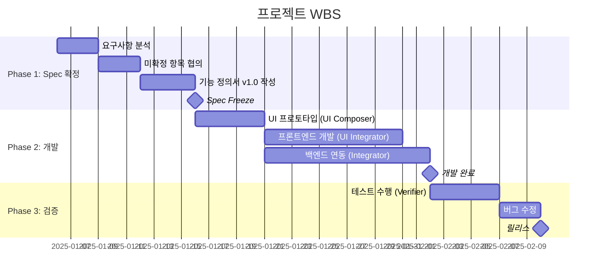
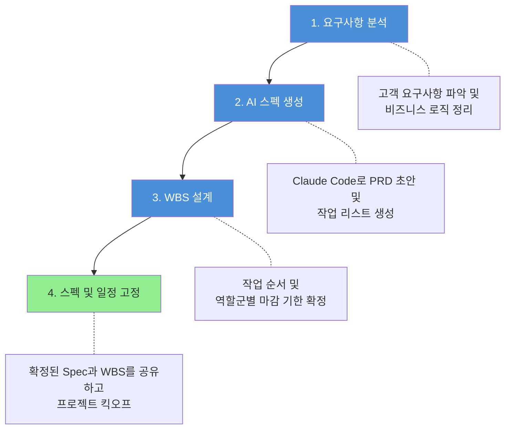
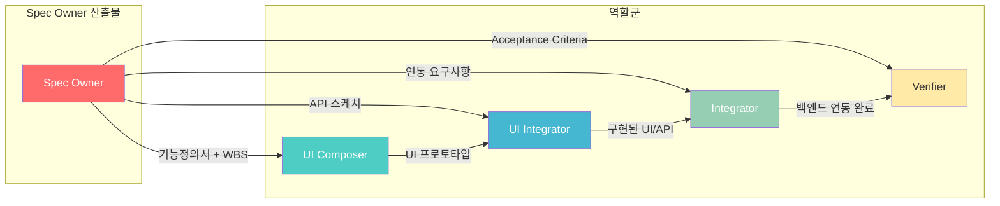
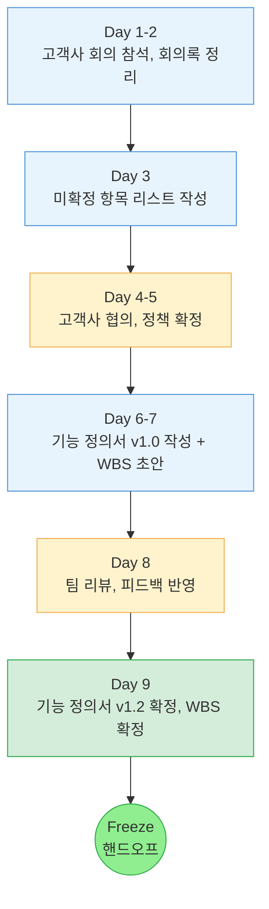

# Spec Owner 역할 정의서

## 0. 문서 정보
**문서명**: Spec Owner 역할 정의서 v2.0
**작성일**: 2025-12-22
**작성자**: 이은재
**기반 프로젝트**: Misto Global (글로벌 스토어 + POS 시스템)

---

## 1. 역할 개요

### 1.1 정의
> **Spec Owner**는 제품의 **논리적 무결성**과 프로젝트의 **적기 인도**를 책임지는 '설계자'이자 '일정 컨트롤러'이다.
> 문제의 **Why · What · Boundary**를 정의하고, 개발팀이 구현할 수 있는 수준으로 **Spec을 고정**하며,
> 이를 실행하기 위한 **WBS**를 설계한다.

### 1.2 핵심 가치
| 가치 | 설명 |
|------|------|
| **명확성** | 모호함을 제거하고, 팀 전체가 같은 그림을 보게 함 |
| **경계 설정** | 무엇을 하고, 무엇을 하지 않을지 확정 |
| **일정 준수** | WBS 기반 일정 관리로 데드라인 사수 |
| **의사결정 기록** | 왜 이렇게 결정했는지 추적 가능하게 함 |

### 1.3 역할 범위
| 영역 | Spec Owner 담당 | 다른 역할 담당 |
|------|----------------|---------------|
| 문제 정의 | O | - |
| 비즈니스 로직/정책 확정 | O | - |
| 기능 범위 (In/Out of Scope) | O | - |
| **WBS 수립 및 일정 관리** | O | - |
| 화면 흐름/UI 스케치 | O (초안) | UI Composer (구체화) |
| API 스펙 | O (스케치) | Integrator (상세 구현) |
| Acceptance Criteria | O | Verifier (검증 수행) |
| 기술 아키텍처 | - | Integrator |
| 실제 코드 구현 | - | UI Integrator, Integrator |
| 테스트/검증 | - | Verifier |

---

## 2. 핵심 책임 (R&R)

### 2.1 사양 및 범위 확정 (Spec & Boundary)

**목표**: 고객사 요구사항을 분석하여 비즈니스 목적(Why)과 기능(What)을 정의

**활동**:
- **범위 고정**: 구현 범위(In-Scope)와 제외 범위(Out-of-Scope)를 엄격히 구분하여 일정 지연 요소 차단
- **AI 활용**: Claude Code로 PRD, User Flow, API 스케치를 생성 및 정제
- 모호한 요구사항을 구체적인 질문으로 변환
- 미확정 항목 리스트 관리 및 추적

**예시 (Misto Global)**:
```
[미확정] 환불 정책
- 영수증 없을 때 환불 가능한가?
- 부분 환불 허용하는가?
- 복합 결제 시 어떻게 취소하는가?

↓ 고객사 협의 후 ↓

[확정] 환불 정책
- 영수증 필수, 없으면 마이너스 거래로 DB 기록
- 전체 환불만 가능, 부분 환불 불가
- 복합 결제 시 모든 결제수단 일괄 취소
```

### 2.2 일정 및 프로젝트 관리 (WBS & Timeline)

**목표**: 프로젝트 전체 과정을 작업 단위로 분할하고 일정 준수 관리

**활동**:
- **WBS 수립**: 전체 과정을 태스크 단위로 분할, 역할군별 선후 관계를 고려한 일정표 작성
- **마일스톤 관리**: 주요 의사결정 지점(Milestone) 설정, 일정 준수 여부 상시 모니터링
- **리스크 대응**: 일정 지연 발생 시 스펙 조정 또는 리소스 재배치로 데드라인 사수

**WBS 구조 예시**:



### 2.3 비즈니스 로직/정책 확정

**입력**: 고객사 정책, 업계 표준, 법적 요구사항
**출력**: 확정된 비즈니스 규칙

**활동**:
- 정책 옵션 도출 및 장단점 분석
- 고객사와 정책 협의 및 확정
- Edge Case 식별 및 처리 방안 정의

**예시 (Misto Global)**:
| 항목 | 정책 |
|------|------|
| Promotion 중복 적용 | 중복 불가, 가장 혜택이 큰 할인 1개만 적용 |
| 임직원 구매한도 초과 시 | 한도 구매금액만큼만 적용, 한도 체크 API 필수 |
| Day Open 재수정 | 1회만 허용, 추가 수정 불가 |

### 2.4 검증 기준 수립 (Acceptance Criteria)

**목표**: Verifier의 테스트 에이전트 구동을 위한 정량적 인수 기준(AC) 작성

**활동**:
- Given-When-Then 형식으로 테스트 시나리오 작성
- 모든 예외 상황(Edge Case)에 대한 정책 수립
- Verifier와 협업하여 검증 기준 확정

**예시**:
```markdown
**기능**: Day Open

**Acceptance Criteria**:
- Given: 점원이 로그인하고 Day Open이 완료되지 않은 상태
- When: Day Open 버튼 클릭 후 시작 잔액 입력하고 Confirm
- Then: 판매 기능이 활성화되고, 현재 시간이 기록됨

**Edge Case**:
- Given: 이미 Day Open이 완료된 상태
- When: Day Open 버튼 클릭
- Then: "이미 개장되었습니다" 메시지 표시, 재실행 불가
```

---

## 3. 업무 프로세스



---

## 4. 핵심 산출물

### 4.1 주요 산출물 목록

| 산출물 | 설명 | 형식 |
|--------|------|------|
| **Fixed PRD (기능 정의서)** | 최종 확정된 기능 명세서 | Markdown |
| **화면 정의서** | 화면별 UI 요소, 동작, 입출력 정의 | Markdown/Figma |
| **Project WBS** | 태스크 단위 일정표 및 마일스톤 | Markdown/Excel |
| **User Flow** | 사용자 업무 흐름도 | Mermaid/Figma |
| **API Sketch** | 연동 인터페이스 초안 | Markdown 테이블 |
| **AC & Edge Case Matrix** | 테스트 통과 기준 및 예외 정책 | Markdown |
| **미확정 항목 리스트** | 고객사 협의 필요 항목 | Markdown/ClickUp |
| **용어 정의서 (Glossary)** | 팀 공통 용어 정의 | Markdown |

### 4.2 산출물 품질 기준

**기능 정의서 체크리스트**:
- [ ] 범위(In/Out of Scope)가 명확한가?
- [ ] 사용자 역할별 권한이 정의되어 있는가?
- [ ] 모든 업무 플로우에 비즈니스 규칙이 명시되어 있는가?
- [ ] Edge Case 처리 방안이 있는가?
- [ ] 용어가 일관되게 사용되고, Glossary에 정의되어 있는가?
- [ ] UI 요소와 동작이 개발 가능한 수준으로 상세한가?

**화면 정의서 체크리스트**:
- [ ] 모든 화면이 식별되고 명명되어 있는가?
- [ ] 화면별 UI 요소(버튼, 입력창, 테이블 등)가 정의되어 있는가?
- [ ] 각 UI 요소의 동작(클릭, 입력, 선택 시)이 명시되어 있는가?
- [ ] 화면 간 이동(Navigation) 흐름이 정의되어 있는가?
- [ ] 입력 필드의 유효성 검증 규칙이 있는가?
- [ ] 에러/경고 메시지가 정의되어 있는가?

**WBS 체크리스트**:
- [ ] 모든 태스크가 담당 역할에 할당되어 있는가?
- [ ] 태스크 간 선후 관계가 명확한가?
- [ ] 마일스톤이 정의되어 있는가?
- [ ] 리스크 대응 버퍼가 포함되어 있는가?

---

## 5. 협업 인터페이스

### 5.1 역할 간 인터페이스



### 5.2 핸드오프 기준

| From | To | 핸드오프 조건 |
|------|-----|-------------|
| Spec Owner | UI Composer | 기능 정의서 v1.0 완료, 핵심 플로우 확정, WBS 공유 |
| Spec Owner | Integrator | API 스케치 완료, 연동 데이터 정의 |
| Spec Owner | Verifier | Acceptance Criteria 정의 완료 |

---

## 6. 역량 요구사항

### 6.1 필수 역량

| 역량 | 설명 |
|------|------|
| **커뮤니케이션** | 고객사/팀원과 명확하게 소통 |
| **문서화** | 체계적이고 읽기 쉬운 문서 작성 |
| **분석력** | 모호한 요구사항에서 핵심 추출 |
| **일정 관리** | WBS 기반 프로젝트 일정 설계 및 모니터링 |
| **도메인 이해** | 해당 비즈니스 도메인 이해 |

### 6.2 도구 활용

| 도구 | 용도 |
|------|------|
| **Claude Code / AI** | 문서 초안 생성, 정책 분석, Edge Case 도출, WBS 작성 |
| **ClickUp / Markdown** | 문서 작성 및 관리 |
| **Mermaid / Figma** | 플로우차트, UI 스케치 |
| **Slack / 회의록** | 커뮤니케이션 및 결정사항 기록 |

---

## 7. 성과 지표

### 7.1 정량 지표

| 지표 | 설명 | 목표 |
|------|------|------|
| 미확정 항목 해소율 | 확정된 항목 / 전체 항목 | 100% (착수 전) |
| 스펙 변경 빈도 | 개발 중 스펙 변경 횟수 | 최소화 |
| 일정 준수율 | 마일스톤 기한 내 완료율 | 90% 이상 |
| 문서 완성도 | 체크리스트 충족률 | 90% 이상 |

### 7.2 정성 지표

- 개발팀이 추가 질문 없이 구현 가능한가?
- 고객사가 기능 정의서를 보고 합의했는가?
- Verifier가 Acceptance Criteria로 테스트 가능한가?
- 일정 지연 시 적절한 리스크 대응이 이루어졌는가?

---

## 8. 부록: Misto Global 사례 분석

### 8.1 Spec Owner 활동 타임라인



### 8.2 AI 활용 포인트

| 단계 | AI 활용 |
|------|---------|
| 회의록 정리 | 회의 내용에서 결정사항/미확정 항목 추출 |
| 미확정 항목 도출 | 비즈니스 로직에서 Edge Case 질문 생성 |
| 기능 정의서 초안 | 구조화된 템플릿으로 초안 생성 |
| WBS 설계 | 작업 분할 및 일정 초안 생성 |
| 용어 정의 | 도메인 용어 정의 및 일관성 검토 |

---

**END OF DOCUMENT**
