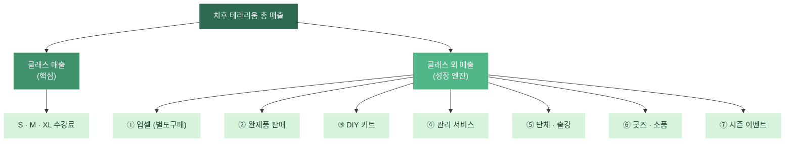

# 치후 테라리움 — 매출 성장 로드맵

> **작성일**: 2026-03-13
> **기준**: 클래스 표준(260313) 확정 후 매출 확대 전략
> **현재 클래스 매출 시뮬레이션**: 보수적 576만 / 기본 1,080만 / 적극적 1,570만

---

## 1. 매출 구조 개요



---

## 2. Phase 1 — 클래스 최적화 (오픈~3개월)

> 클래스 외 매출을 벌이기 전에, 본업부터 안정시키는 단계.

### 2.1 업셀 구조 활성화

이미 클래스 표준에 별도구매 옵션이 있으므로 **전환율을 높이는 데 집중**.

| 액션 | 기대 효과 |
|------|----------|
| 프리미엄 이끼·식물을 **실물 샘플로 진열** | "이것도 넣어도 되나요?" → 자연스러운 업셀 |
| 피규어 진열장 배치 (인기 캐릭터 위주) | 충동구매 유도, 특히 커플·친구 그룹 |
| 수업 중 **꾸미기 단계에서** 옵션 안내 | 완성 직전 "여기에 이거 올리면 예쁘겠다" |
| 가격표를 예쁘게 (손글씨 or 빈티지 라벨) | 공방 분위기와 일치, 가격 저항 감소 |

**목표**: 수강생 30%가 평균 +7,000원 추가 구매

```
월 수강생 180명 × 30% × 7,000원 = +378,000원/월
```

### 2.2 리뷰·재방문 시스템

| 액션 | 목적 |
|------|------|
| 수업 후 카카오톡 자동 메시지 (관리법 + 리뷰 링크) | 네이버 리뷰 확보 |
| 재방문 쿠폰 (3개월 내 10% 할인) | 리텐션, S→M 업그레이드 유도 |
| 인스타 태그 이벤트 (#치후테라리움 → 음료 무료) | UGC 확보 + 바이럴 |

---

## 3. Phase 2 — 완제품 판매 (3~6개월)

> 클래스가 안정되면 **빈 시간(월요일 + 오후 공백)**을 활용해 완제품 제작.

### 3.1 상품 라인업

| 상품 | 판매가 | 원가 | 마진 | 비고 |
|------|--------|------|------|------|
| 미니 테라리움 (10cm) | 25,000원 | 6,000원 | 76% | 선물용, 낮은 진입장벽 |
| S급 완제품 (12~15cm) | 45,000원 | 10,000원 | 78% | 클래스 체험 어려운 고객 |
| M급 완제품 (15~18cm) | 65,000원 | 12,000원 | 82% | 인테리어·선물 |
| 시즌 한정 (크리스마스 등) | 55,000~80,000원 | 15,000원 | 73~81% | 한정 수량, 프리미엄 |

### 3.2 판매 채널

| 채널 | 특징 | 수수료 |
|------|------|--------|
| **공방 현장** | 수업 후 "이것도 있어요" | 0% |
| **chihoo.com 온라인** | 자체몰, 택배 발송 | 0% (배송비 별도) |
| **네이버 스마트스토어** | 검색 유입, 선물하기 | ~5% |
| **카카오톡 선물하기** | 선물 수요 (생일, 집들이) | ~15% |
| **아이디어스** | 핸드메이드 플랫폼, 타겟 일치 | ~20% |

### 3.3 목표

```
공방 현장:  월 10개 × 50,000원 =  500,000원
온라인:    월 15개 × 50,000원 =  750,000원
──────────────────────────────────────────
합계:                          1,250,000원/월
```

### 3.4 포장·배송

| 항목 | 기준 |
|------|------|
| 포장 | 완충재 + 전용 박스 (흔들림 방지) |
| 배송비 | 구매자 부담 (4,000원) or 50,000원 이상 무배 |
| 배송 주기 | 주 2회 (화·금) 일괄 발송 |
| 케어 카드 | 관리법 안내 카드 동봉 |

---

## 4. Phase 2 — DIY 키트 (3~6개월)

> 직접 오기 어려운 고객, 지방 고객, 단체 선물용.

### 4.1 키트 구성

| 포함 | 내용 |
|------|------|
| 유리 용기 (M사이즈) | 15~18cm |
| 이끼 3종 (밀봉 팩) | 비단이끼 + 털깃털이끼 + 꼬리이끼 |
| 식물 1포트 | 후마타 고사리 |
| 배수층 세트 | 화산석 + 활성탄 + 배양토 (소분) |
| 장식 세트 | 색모래 + 장식 자갈 |
| 도구 | 핀셋 + 분무기 (일회용 or 미니) |
| 가이드 | QR → 영상 튜토리얼 (15분) |
| 케어 카드 | 관리법 안내 |

### 4.2 가격

| 항목 | 금액 |
|------|------|
| 키트 원가 | ~15,000원 |
| 포장·배송자재 | ~3,000원 |
| **판매가** | **42,000원** |
| **마진** | **24,000원 (57%)** |

> 클래스(60,000원)보다 저렴하지만, 체험 가치 없이 재료만 제공이므로 적정 가격.

### 4.3 목표

```
월 20키트 × 42,000원 = 840,000원/월
```

---

## 5. Phase 3 — 단체·출강 (6개월~)

> 공방이 안정된 후 외부 수요 확대. B2B 채널.

### 5.1 유형

| 유형 | 인원 | 인당 가격 | 특징 |
|------|------|----------|------|
| **기업 워크숍** | 10~30명 | 45,000~50,000원 | 팀빌딩, 복지 행사 |
| **학교·방과후** | 15~25명 | 30,000~35,000원 | 교육청 예산, 학기 단위 |
| **지자체·문화센터** | 15~20명 | 35,000~40,000원 | 주민 프로그램, 시즌별 |
| **카페·호텔 콜라보** | 10~15명 | 50,000~55,000원 | 공간 제공, 마케팅 시너지 |

### 5.2 출강 원가 (20명 기준)

| 항목 | 금액 |
|------|------|
| 재료비 (20명 × 13,300원) | 266,000원 |
| 교통비 | 30,000원 |
| 도구 세트 (핀셋 등) | 20,000원 |
| **총 원가** | **316,000원** |
| **매출** (20명 × 45,000원) | **900,000원** |
| **마진** | **584,000원 (65%)** |

### 5.3 영업 채널

| 채널 | 방법 |
|------|------|
| 지자체 | 구청 문화체육과 프로그램 공모 신청 |
| 기업 | 복지몰 입점, 회사 총무팀 직접 영업 |
| 학교 | 방과후학교 강사 등록, 교육청 플랫폼 |
| 플랫폼 | 프립(Frip), 클래스101 기업교육 |
| 호텔·카페 | 인스타 DM, 콜라보 제안서 |

### 5.4 목표

```
월 1~2회 × 600,000원 = 600,000~1,200,000원/월
```

---

## 6. Phase 3 — 관리 서비스 (6개월~)

> 수강생 데이터가 쌓이면 자연스럽게 발생하는 수요.

### 6.1 서비스 메뉴

| 서비스 | 가격 | 내용 |
|--------|------|------|
| 이끼 교체 | 15,000원 | 죽은 이끼 제거 + 새 이끼 식재 |
| 식물 교체 | 10,000~15,000원 | 식물 교체 + 배치 |
| 리뉴얼 (전체) | 25,000~35,000원 | 전체 리셋 + 재식재 |
| 관리 상담 | 무료 | 카카오톡 1:1 (재방문 유도) |

### 6.2 운영

- 방문 관리: 수업 없는 시간대 활용 (월요일 or 오후 공백)
- 택배 관리: 고객이 보내면 작업 후 반송 (왕복 배송비 고객 부담)
- **카카오톡 알림**: 수강 3개월 후 자동 안내 "테라리움 잘 크고 있나요?"

### 6.3 목표

```
월 10건 × 20,000원 = 200,000원/월
```

---

## 7. 상시 — 굿즈·소품 (Phase 1부터)

> 투자 거의 없이 공방 분위기 + 추가 수입.

### 7.1 상품

| 상품 | 판매가 | 원가 | 비고 |
|------|--------|------|------|
| 미니 분무기 | 8,000원 | 2,500원 | 관리 필수템, 브랜드 로고 |
| 핀셋 세트 | 12,000원 | 4,000원 | L자+직선, 관리용 |
| 이끼 리필팩 | 5,000원 | 1,500원 | 교체용 이끼 소분 |
| 케어 키트 (분무기+핀셋+리필) | 22,000원 | 7,000원 | 세트 할인 |
| 치후 스티커 | 2,000원 | 300원 | 브랜딩, 저가 충동구매 |
| 식물 도감 엽서 세트 | 8,000원 | 2,000원 | 이끼 일러스트 엽서 |

### 7.2 목표

```
월 평균 150,000원 (공방 현장 판매 위주)
```

---

## 8. 시즌 이벤트

> 특정 시기에 매출을 집중적으로 끌어올리는 장치.

| 시즌 | 시기 | 이벤트 | 기대 효과 |
|------|------|--------|----------|
| **발렌타인·화이트데이** | 2~3월 | 커플 클래스 (+포토존) | 커플 2인 동시 예약 증가 |
| **어버이날** | 5월 | "부모님께 드리는 작은 숲" 패키지 | 선물 수요 + 완제품 판매 |
| **여름방학** | 7~8월 | 키즈·가족 클래스 (S사이즈) | 가족 단위 유입 |
| **추석·설** | 명절 전 2주 | 선물용 완제품 세트 | 온라인 완제품 매출 피크 |
| **크리스마스** | 12월 | 한정판 크리스마스 테라리움 | 시즌 한정 프리미엄 |
| **신학기** | 3월 | 대학생 원데이 (SNS 할인) | 신규 고객 유입 |

### 시즌별 추가 매출 예상

```
연 6회 × 평균 +500,000원 = +3,000,000원/년 (+250,000원/월 환산)
```

---

## 9. 매출 성장 타임라인

### Phase 1: 안정화 (오픈~3개월)

| 매출원 | 월 매출 |
|--------|--------|
| 클래스 (시나리오 A~B 사이) | 700만 |
| 업셀 | +30만 |
| 굿즈 | +15만 |
| **합계** | **~745만** |
| 고정비 | -150만 |
| 변동비 (원가) | -140만 |
| **대표 수입** | **~455만** |

### Phase 2: 확장 (3~6개월)

| 매출원 | 월 매출 |
|--------|--------|
| 클래스 (시나리오 B) | 1,080만 |
| 업셀 | +38만 |
| 완제품 판매 | +100만 |
| DIY 키트 | +60만 |
| 굿즈 | +15만 |
| 시즌 이벤트 (환산) | +25만 |
| **합계** | **~1,318만** |
| 고정비 | -150만 |
| 변동비 | -260만 |
| **대표 수입** | **~908만** |

### Phase 3: 성숙 (6개월~)

| 매출원 | 월 매출 |
|--------|--------|
| 클래스 (시나리오 B~C) | 1,200만 |
| 업셀 | +45만 |
| 완제품 판매 | +125만 |
| DIY 키트 | +84만 |
| 단체·출강 | +90만 |
| 관리 서비스 | +20만 |
| 굿즈 | +15만 |
| 시즌 이벤트 (환산) | +25만 |
| **합계** | **~1,604만** |
| 고정비 | -170만 (마케팅 증가) |
| 변동비 | -320만 |
| **대표 수입** | **~1,114만** |

---

## 10. 우선순위 매트릭스

| | **투자 적음** | **투자 필요** |
|---|-------------|-------------|
| **효과 큼** | ① 업셀 구조화 | ⑤ 단체·출강 영업 |
| | ② 리뷰 시스템 | ④ DIY 키트 |
| **효과 보통** | ⑦ 시즌 이벤트 | ③ 완제품 온라인 판매 |
| | ⑥ 관리 서비스 | ⑧ 굿즈 제작 |

> **즉시 시작**: ①② → 오픈 시점부터 별도 투자 없이 가능
> **3개월 후**: ③④⑦ → 클래스 안정 후 시간 여유 활용
> **6개월 후**: ⑤⑥⑧ → 데이터·레퍼런스 축적 후

---

## 11. 핵심 KPI

| 지표 | Phase 1 목표 | Phase 2 목표 | Phase 3 목표 |
|------|-------------|-------------|-------------|
| 월 클래스 횟수 | 24회 | 36회 | 40회+ |
| 평균 수강생 | 4명 | 5명 | 5명 |
| 업셀 전환율 | 20% | 30% | 35% |
| 네이버 리뷰 수 | 30개 | 100개 | 200개+ |
| 재방문율 | - | 15% | 25% |
| 클래스 외 매출 비중 | 6% | 18% | 25% |
| **월 총매출** | **745만** | **1,318만** | **1,604만** |
| **대표 수입** | **455만** | **908만** | **1,114만** |

---

## 12. 주의사항

1. **클래스가 핵심이다**: 외 매출은 클래스 품질이 뒷받침될 때만 작동. 클래스 경험이 별로면 완제품도, 키트도 안 팔림.
2. **한 번에 하나씩**: Phase 1이 안정되기 전에 Phase 2~3를 동시에 벌이면 품질이 떨어짐. 1인 운영의 한계를 인식할 것.
3. **시간이 자본이다**: 1인 공방에서 가장 부족한 건 돈이 아니라 시간. 완제품·키트 제작은 월요일(휴무) + 오후 공백 시간을 활용.
4. **재고 리스크**: 완제품·키트는 살아있는 식물이므로 장기 보관 불가. 주문제작 or 소량 제작 원칙.
5. **단체·출강 주의**: 외부 출강은 수익은 좋지만, 그 날 공방 클래스를 못 돌림. 빈도 조절 필요.
