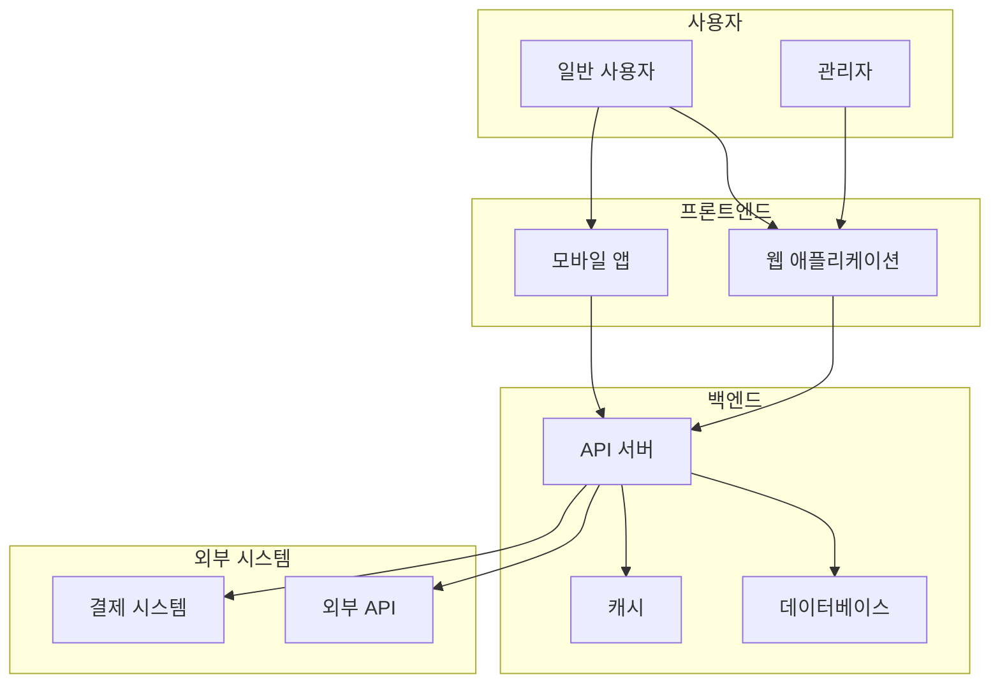
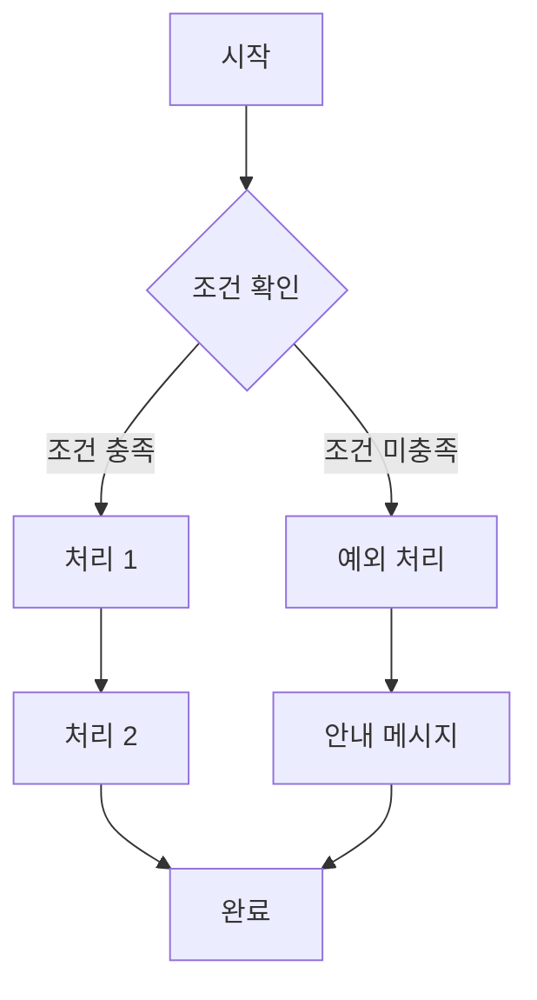
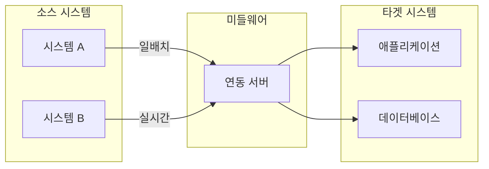

# {{PROJECT_NAME}} 기능정의서

## 0. 문서 정보

| 항목 | 내용 |
|------|------|
| 문서명 | {{PROJECT_NAME}} v{{VERSION}} 기능정의서 |
| 프로젝트 | {{PROJECT_DESCRIPTION}} |
| 작성일 | {{DATE}} |
| 작성자 | {{AUTHOR}} |

### 변경 이력

| 버전 | 날짜 | 작성자 | 변경 내용 |
|------|------|--------|----------|
| 1.0 | {{DATE}} | {{AUTHOR}} | 초안 작성 |

---

## 1. 시스템 개요

### 1.1 목적

{{PROJECT_PURPOSE}}

### 1.2 범위

**포함 (In Scope)**:
- 핵심 기능 1
- 핵심 기능 2
- 핵심 기능 3

**제외 (Out of Scope)**:
- 제외 기능 1 (사유: {{EXCLUSION_REASON}})
- 제외 기능 2 (사유: 별도 프로젝트)

---

## 2. 시스템 구성

### 2.1 서비스 구조

| 서비스 | 설명 | 대상 | 비고 |
|--------|------|------|------|
| {{SERVICE_1}} | {{SERVICE_1_DESC}} | {{TARGET_1}} | - |
| {{SERVICE_2}} | {{SERVICE_2_DESC}} | {{TARGET_2}} | - |

### 2.2 사용자 유형

| 사용자 | 역할 | 주요 권한 |
|--------|------|----------|
| 관리자 | 시스템 관리 | 전체 관리, 설정, 사용자 관리 |
| 일반 사용자 | 서비스 이용 | 조회, 등록, 수정 |
| 게스트 | 제한적 이용 | 조회만 가능 |

### 2.3 시스템 아키텍처

---

## 3. 핵심 업무 플로우

### 3.1 주요 플로우

### 3.2 비즈니스 규칙

| 규칙 ID | 규칙명 | 설명 | 적용 범위 |
|---------|--------|------|----------|
| BR-001 | 규칙 1 | 규칙 상세 설명 | 전체 |
| BR-002 | 규칙 2 | 규칙 상세 설명 | 특정 기능 |
| BR-003 | 규칙 3 | 규칙 상세 설명 | 특정 사용자 |

---

## 4. 주요 기능

### 4.1 기능 목록

| 기능 ID | 기능명 | 설명 | 우선순위 |
|---------|--------|------|----------|
| F-001 | 기능 1 | 기능 1 설명 | 필수 |
| F-002 | 기능 2 | 기능 2 설명 | 필수 |
| F-003 | 기능 3 | 기능 3 설명 | 선택 |
| F-004 | 기능 4 | 기능 4 설명 | 선택 |

### 4.2 기능 상세

#### F-001: {{FUNCTION_1_NAME}}

| 항목 | 내용 |
|------|------|
| 기능 ID | F-001 |
| 기능명 | {{FUNCTION_1_NAME}} |
| 설명 | {{FUNCTION_1_DESC}} |
| 선행 조건 | {{PRECONDITION}} |
| 후행 조건 | {{POSTCONDITION}} |
| 우선순위 | 필수 |

**처리 로직**:
1. 단계 1
2. 단계 2
3. 단계 3

**예외 처리**:
- 예외 1: 처리 방법
- 예외 2: 처리 방법

---

## 5. 외부 연동

### 5.1 연동 시스템 목록

| 시스템 | 연동 방식 | 데이터 | 주기 |
|--------|----------|--------|------|
| 시스템 A | REST API | 마스터 데이터 | 일 1회 |
| 시스템 B | REST API | 트랜잭션 데이터 | 실시간 |
| 시스템 C | Webhook | 이벤트 데이터 | 이벤트 기반 |

### 5.2 연동 데이터 흐름

### 5.3 마스터 데이터 동기화

| 데이터 | 동기화 주기 | 설명 |
|--------|------------|------|
| 데이터 1 | 일 1회 | 데이터 1 설명 |
| 데이터 2 | 일 1회 | 데이터 2 설명 |
| 데이터 3 | 실시간 | 데이터 3 설명 |

---

## 6. 데이터 정의

### 6.1 주요 엔티티

| 엔티티 | 설명 | 주요 속성 |
|--------|------|----------|
| Entity1 | 엔티티 1 설명 | ID, 이름, 상태, 생성일시 |
| Entity2 | 엔티티 2 설명 | ID, 타입, 값, 유효기간 |
| Entity3 | 엔티티 3 설명 | ID, 소유자, 내용, 수정일시 |

### 6.2 상태 정의

| 상태 코드 | 상태명 | 설명 | 다음 상태 |
|----------|--------|------|----------|
| PENDING | 대기중 | 초기 상태 | ACTIVE, CANCELLED |
| ACTIVE | 활성 | 처리 중 | COMPLETED, FAILED |
| COMPLETED | 완료 | 정상 완료 | - |
| FAILED | 실패 | 처리 실패 | PENDING |
| CANCELLED | 취소 | 사용자 취소 | - |

---

## 7. 비기능 요구사항

| 구분 | 요구사항 | 기준 |
|------|----------|------|
| 성능 | 페이지 로딩 | 3초 이내 |
| 성능 | API 응답 | 500ms 이내 |
| 가용성 | 서비스 가동률 | 99.5% 이상 |
| 보안 | 데이터 암호화 | TLS 1.2 이상 |
| 보안 | 개인정보 보호 | 관련 법규 준수 |
| 확장성 | 동시 접속자 | {{CONCURRENT_USERS}}명 이상 |

---

## 8. 기술 스택

| 구분 | 기술 |
|------|------|
| 프론트엔드 | {{FRONTEND_TECH}} |
| 백엔드 | {{BACKEND_TECH}} |
| 데이터베이스 | {{DATABASE_TECH}} |
| 캐시 | {{CACHE_TECH}} |
| 클라우드 | {{CLOUD_TECH}} |
| CI/CD | {{CICD_TECH}} |

---

## 9. 용어 정의

| 용어 | 영문 | 정의 |
|------|------|------|
| 용어 1 | Term 1 | 용어 1 정의 |
| 용어 2 | Term 2 | 용어 2 정의 |
| 용어 3 | Term 3 | 용어 3 정의 |

---

## 10. 미확정 사항

> 아래 항목은 추가 협의가 필요합니다.

| 항목 | 질문 | 옵션 | 협의 대상 | 상태 |
|------|------|------|----------|------|
| 미확정 1 | 질문 내용 | A안 / B안 | 고객사 | 🔴 미해결 |
| 미확정 2 | 질문 내용 | A안 / B안 / C안 | 내부 | 🟡 협의중 |

---

**END OF DOCUMENT**
