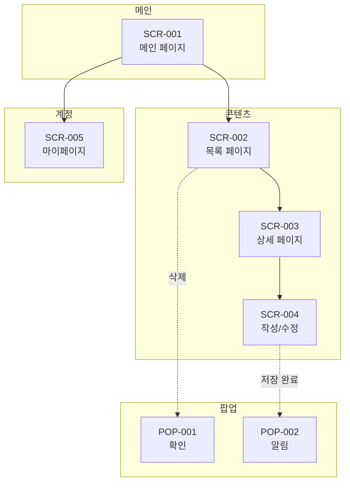

# {{PROJECT_NAME}} 화면정의서

## 0. 문서 정보

| 항목 | 내용 |
|------|------|
| 문서명 | {{PROJECT_NAME}} v{{VERSION}} 화면정의서 |
| 프로젝트 | {{PROJECT_DESCRIPTION}} |
| 작성일 | {{DATE}} |
| 작성자 | {{AUTHOR}} |
| 관련 문서 | {{PROJECT_NAME}}_기능정의서.md |

### 변경 이력

| 버전 | 날짜 | 작성자 | 변경 내용 |
|------|------|--------|----------|
| 1.0 | {{DATE}} | {{AUTHOR}} | 초안 작성 |

---

## 1. 화면 구성 개요

### 1.1 화면 목록

| No | 화면 ID | 화면명 | 유형 | 접근 권한 | 디자인 참조 | 비고 |
|----|---------|--------|------|----------|------------|------|
| 1 | SCR-001 | 메인 페이지 | 메인 | 전체 | {{DESIGN_REF}} | 랜딩 |
| 2 | SCR-002 | 목록 페이지 | 서브 | 전체 | {{DESIGN_REF}} | - |
| 3 | SCR-003 | 상세 페이지 | 서브 | 전체 | {{DESIGN_REF}} | - |
| 4 | SCR-004 | 작성/수정 페이지 | 서브 | 회원 | {{DESIGN_REF}} | - |
| 5 | SCR-005 | 마이페이지 | 서브 | 회원 | {{DESIGN_REF}} | - |
| 6 | POP-001 | 확인 팝업 | 팝업 | 전체 | 공통 | 모달 |
| 7 | POP-002 | 알림 팝업 | 팝업 | 전체 | 공통 | 토스트 |

### 1.2 화면 흐름도

---

## 2. 공통 UI 정의

### 2.1 공통 레이아웃

| 영역 | 설명 | 높이 |
|------|------|------|
| Header | 로고, 메뉴, 사용자 정보 | 60px |
| Main Content | 페이지별 콘텐츠 영역 | 가변 |
| Footer | 저작권, 링크 | 80px |

### 2.2 Header 구성

| 요소 | 타입 | 설명 | 동작 |
|------|------|------|------|
| 로고 | Image/Link | 서비스 로고 | 클릭 시 메인으로 이동 |
| 메뉴 1 | Link | GNB 메뉴 | 클릭 시 해당 페이지 이동 |
| 메뉴 2 | Link | GNB 메뉴 | 클릭 시 해당 페이지 이동 |
| 검색 | Button | 검색 아이콘 | 클릭 시 검색 모달 오픈 |
| 알림 | Button | 알림 아이콘 + Badge | 클릭 시 알림 패널 오픈 |
| 프로필 | Button | 사용자 아이콘 | 클릭 시 드롭다운 메뉴 |

### 2.3 공통 컴포넌트

| 컴포넌트 | 설명 | 상태 |
|----------|------|------|
| Button - Primary | 주요 액션 버튼 | Default / Hover / Active / Disabled |
| Button - Secondary | 보조 버튼 | Default / Hover / Active / Disabled |
| Button - Text | 텍스트 링크 버튼 | Default / Hover / Active |
| Input | 텍스트 입력 | Default / Focus / Error / Disabled |
| Select | 드롭다운 선택 | Default / Open / Disabled |
| Checkbox | 체크박스 | Unchecked / Checked / Disabled |
| Radio | 라디오 버튼 | Unselected / Selected / Disabled |
| Toggle | 토글 스위치 | Off / On / Disabled |
| Badge | 상태 뱃지 | Primary / Success / Warning / Error |
| Toast | 알림 메시지 | Success / Warning / Error / Info |
| Modal | 팝업/모달 | Center / Side |
| Table | 데이터 테이블 | Default / Hover / Selected |
| Pagination | 페이지네이션 | Default / Active / Disabled |

### 2.4 반응형 정책

| 디바이스 | 화면 너비 | 레이아웃 |
|----------|----------|----------|
| Desktop | 1200px 이상 | 전체 레이아웃 |
| Tablet | 768px ~ 1199px | 축소 레이아웃 |
| Mobile | 767px 이하 | 모바일 레이아웃 |

---

## 3. 화면 상세 정의

### 3.1 [SCR-001] 메인 페이지

#### 3.1.1 화면 정보

| 항목 | 내용 |
|------|------|
| 화면 ID | SCR-001 |
| 화면명 | 메인 페이지 |
| 목적 | 서비스 소개 및 주요 기능 진입점 |
| 접근 권한 | 전체 |
| 진입 경로 | 사이트 접속 시 / 로고 클릭 시 |
| 디자인 참조 | {{DESIGN_REF}} |

#### 3.1.2 화면 구성

| 영역 | 설명 | 참조 |
|------|------|------|
| [A] Hero Section | 메인 비주얼 + CTA 버튼 | - |
| [B] Feature Section | 주요 기능 소개 | - |
| [C] Content Section | 콘텐츠 목록 (캐러셀) | - |
| [D] CTA Section | 행동 유도 배너 | - |

#### 3.1.3 영역별 상세 정의

**[A] Hero Section**

| 요소 | 타입 | 설명 | 동작 |
|------|------|------|------|
| 배경 이미지 | Image | 메인 비주얼 | - |
| 타이틀 | Text (H1) | 서비스 타이틀 | - |
| 서브 타이틀 | Text | 서비스 설명 | - |
| CTA 버튼 | Button (Primary) | 시작하기 | 클릭 시 해당 페이지 이동 |

**[B] Feature Section**

| 요소 | 타입 | 설명 | 동작 |
|------|------|------|------|
| 섹션 타이틀 | Text (H2) | "주요 기능" | - |
| 기능 카드 | Card | 아이콘 + 제목 + 설명 (3~4개) | 클릭 시 상세 이동 |

---

### 3.2 [SCR-002] 목록 페이지

#### 3.2.1 화면 정보

| 항목 | 내용 |
|------|------|
| 화면 ID | SCR-002 |
| 화면명 | 목록 페이지 |
| 목적 | 콘텐츠 목록 조회 및 필터링 |
| 접근 권한 | 전체 |
| 진입 경로 | 메인 > 메뉴 클릭 |
| 디자인 참조 | {{DESIGN_REF}} |

#### 3.2.2 화면 구성

| 영역 | 설명 |
|------|------|
| [A] 페이지 헤더 | 타이틀 + 등록 버튼 |
| [B] 검색/필터 | 검색 바 + 필터 옵션 |
| [C] 목록 테이블 | 데이터 테이블 + 정렬 |
| [D] 페이지네이션 | 페이지 이동 |

#### 3.2.3 영역별 상세 정의

**[B] 검색/필터**

| 요소 | 타입 | 설명 | 동작 |
|------|------|------|------|
| 검색 입력 | Input | 키워드 검색 | Enter 시 검색 실행 |
| 검색 버튼 | Button | 검색 아이콘 | 클릭 시 검색 실행 |
| 필터 드롭다운 | Select | 상태/카테고리 필터 | 선택 시 필터 적용 |
| 정렬 드롭다운 | Select | 정렬 기준 | 선택 시 정렬 적용 |

**[C] 목록 테이블**

| 컬럼 | 타입 | 너비 | 정렬 | 동작 |
|------|------|------|------|------|
| 체크박스 | Checkbox | 40px | - | 선택 |
| 번호 | Text | 60px | - | - |
| 제목 | Text/Link | 가변 | - | 클릭 시 상세 이동 |
| 상태 | Badge | 100px | - | - |
| 등록일 | Text | 120px | 정렬 가능 | - |
| 작성자 | Text | 100px | - | - |
| 액션 | Button | 80px | - | 수정/삭제 |

**정렬 옵션**:
- 최신순 (Default)
- 등록일순
- 제목순
- 조회순

---

### 3.3 [SCR-003] 상세 페이지

#### 3.3.1 화면 정보

| 항목 | 내용 |
|------|------|
| 화면 ID | SCR-003 |
| 화면명 | 상세 페이지 |
| 목적 | 콘텐츠 상세 정보 확인 |
| 접근 권한 | 전체 |
| 진입 경로 | 목록 > 항목 클릭 |
| 디자인 참조 | {{DESIGN_REF}} |

#### 3.3.2 화면 구성

| 영역 | 설명 |
|------|------|
| [A] 페이지 헤더 | 제목 + 메타 정보 |
| [B] 콘텐츠 영역 | 본문 내용 |
| [C] 액션 영역 | 버튼 그룹 (수정/삭제/목록) |
| [D] 관련 콘텐츠 | 연관 항목 목록 |

#### 3.3.3 영역별 상세 정의

**[A] 페이지 헤더**

| 요소 | 타입 | 설명 | 동작 |
|------|------|------|------|
| 뒤로가기 | Button | 화살표 아이콘 | 클릭 시 목록으로 이동 |
| 제목 | Text (H1) | 콘텐츠 제목 | - |
| 상태 뱃지 | Badge | 상태 표시 | - |
| 작성자 | Text | 작성자 이름 | - |
| 등록일 | Text | 등록일시 | - |
| 조회수 | Text | 조회 횟수 | - |

**[C] 액션 영역**

| 요소 | 타입 | 조건 | 동작 |
|------|------|------|------|
| 수정 | Button (Secondary) | 작성자 본인만 | 클릭 시 수정 페이지 이동 |
| 삭제 | Button (Text/Danger) | 작성자 본인만 | 클릭 시 POP-001 오픈 |
| 목록 | Button (Secondary) | 항상 | 클릭 시 목록으로 이동 |

---

### 3.4 [SCR-004] 작성/수정 페이지

#### 3.4.1 화면 정보

| 항목 | 내용 |
|------|------|
| 화면 ID | SCR-004 |
| 화면명 | 작성/수정 페이지 |
| 목적 | 콘텐츠 등록 및 수정 |
| 접근 권한 | 회원 |
| 진입 경로 | 목록 > 등록 버튼 / 상세 > 수정 버튼 |
| 디자인 참조 | {{DESIGN_REF}} |

#### 3.4.2 화면 구성

| 영역 | 설명 |
|------|------|
| [A] 페이지 헤더 | 타이틀 (등록/수정) |
| [B] 폼 영역 | 입력 필드들 |
| [C] 액션 영역 | 저장/취소 버튼 |

#### 3.4.3 입력 필드 정의

| 필드명 | 타입 | 필수 | 유효성 검사 | 에러 메시지 |
|--------|------|------|------------|-------------|
| 제목 | Input | O | 1~100자 | "제목을 입력해주세요" |
| 카테고리 | Select | O | 선택 필수 | "카테고리를 선택해주세요" |
| 내용 | Textarea | O | 1~5000자 | "내용을 입력해주세요" |
| 첨부파일 | File | X | 10MB 이하, jpg/png/pdf | "파일 형식 또는 크기를 확인해주세요" |
| 공개 여부 | Toggle | X | - | - |

---

### 3.5 [SCR-005] 마이페이지

#### 3.5.1 화면 정보

| 항목 | 내용 |
|------|------|
| 화면 ID | SCR-005 |
| 화면명 | 마이페이지 |
| 목적 | 사용자 정보 및 활동 내역 관리 |
| 접근 권한 | 회원 |
| 진입 경로 | Header 프로필 아이콘 클릭 |
| 디자인 참조 | {{DESIGN_REF}} |

#### 3.5.2 화면 구성

| 영역 | 설명 |
|------|------|
| [A] 프로필 영역 | 프로필 이미지, 이름, 이메일 |
| [B] 사이드 메뉴 | 내 정보, 내 활동, 설정 |
| [C] 콘텐츠 영역 | 선택된 메뉴 내용 |

#### 3.5.3 사이드 메뉴

| 메뉴 | 설명 |
|------|------|
| 내 정보 | 프로필 수정 |
| 내 활동 | 내가 작성한 글/댓글 |
| 알림 설정 | 알림 on/off |
| 계정 설정 | 비밀번호 변경, 탈퇴 |

---

## 4. 팝업 정의

### 4.1 [POP-001] 확인 팝업

#### 4.1.1 팝업 정보

| 항목 | 내용 |
|------|------|
| 팝업 ID | POP-001 |
| 팝업명 | 확인 팝업 |
| 목적 | 사용자 확인이 필요한 액션 전 확인 |
| 호출 조건 | 삭제, 취소 등 중요 액션 시 |
| 크기 | 400px x 200px |

#### 4.1.2 팝업 구성

| 요소 | 타입 | 설명 | 동작 |
|------|------|------|------|
| 아이콘 | Icon | 경고 아이콘 | - |
| 타이틀 | Text | "정말 삭제하시겠습니까?" | - |
| 설명 | Text | "삭제된 데이터는 복구할 수 없습니다." | - |
| 취소 버튼 | Button (Secondary) | "취소" | 팝업 닫기 |
| 확인 버튼 | Button (Primary/Danger) | "삭제" | 액션 실행 후 팝업 닫기 |

---

### 4.2 [POP-002] 알림 팝업 (Toast)

#### 4.2.1 팝업 정보

| 항목 | 내용 |
|------|------|
| 팝업 ID | POP-002 |
| 팝업명 | 알림 팝업 |
| 목적 | 액션 결과 알림 |
| 호출 조건 | 저장 완료, 에러 발생 등 |
| 위치 | 화면 우측 상단 |
| 자동 닫힘 | 3초 후 |

#### 4.2.2 유형별 정의

| 유형 | 아이콘 | 색상 | 예시 메시지 |
|------|--------|------|------------|
| Success | 체크 | 녹색 | "저장되었습니다" |
| Error | X | 빨강 | "오류가 발생했습니다" |
| Warning | 느낌표 | 주황 | "필수 항목을 확인해주세요" |
| Info | i | 파랑 | "새로운 알림이 있습니다" |

---

## 5. 검색/필터 정의

### 5.1 목록 페이지 필터

| 검색 조건 | 타입 | 설명 | 필수 |
|----------|------|------|------|
| 키워드 | Input | 제목/내용 검색 | X |
| 카테고리 | Multi Select | 카테고리 필터 | X |
| 상태 | Single Select | 상태 필터 | X |
| 등록일 | Date Range | 기간 필터 | X |
| 작성자 | Input | 작성자 검색 | X |

---

## 6. 상태별 화면 변화

### 6.1 공통 상태 UI

| 상태 | 조건 | UI 변화 |
|------|------|---------|
| 로딩 중 | 데이터 조회 중 | 스켈레톤 UI / 스피너 표시 |
| 데이터 없음 | 결과 0건 | "데이터가 없습니다" + 등록 버튼 |
| 에러 | API 호출 실패 | "오류가 발생했습니다" + 재시도 버튼 |
| 권한 없음 | 접근 불가 | "접근 권한이 없습니다" + 이전 페이지 버튼 |

---

## 7. 접근성

| 항목 | 적용 내용 |
|------|----------|
| 키보드 네비게이션 | Tab 키로 모든 인터랙티브 요소 접근 가능 |
| 스크린 리더 | ARIA 라벨 적용, alt 텍스트 필수 |
| 색상 대비 | WCAG 2.1 AA 기준 충족 (4.5:1 이상) |
| 폰트 크기 | 최소 14px, 확대 가능 |
| 포커스 표시 | 모든 포커스 가능 요소에 시각적 표시 |

---

## 부록

### A. 화면 ID 규칙

| 접두사 | 유형 | 예시 |
|--------|------|------|
| SCR | 일반 화면 | SCR-001, SCR-002 |
| POP | 팝업/모달 | POP-001, POP-002 |

### B. 색상 팔레트

| 색상명 | 코드 | 용도 |
|--------|------|------|
| Primary | #3182F6 | 주요 버튼, 링크 |
| Secondary | #6B7280 | 보조 텍스트, 테두리 |
| Success | #10B981 | 성공 메시지 |
| Warning | #F59E0B | 경고 메시지 |
| Error | #EF4444 | 에러 메시지 |
| Text Primary | #1F2937 | 본문 텍스트 |
| Text Secondary | #6B7280 | 보조 텍스트 |
| Border | #E5E7EB | 테두리 |
| Background | #F9FAFB | 배경색 |

### C. 폰트 정의

| 용도 | 크기 | 굵기 |
|------|------|------|
| H1 | 32px | Bold (700) |
| H2 | 24px | Bold (700) |
| H3 | 18px | SemiBold (600) |
| Body | 14px | Regular (400) |
| Label | 12px | Medium (500) |
| Caption | 11px | Regular (400) |

### D. 아이콘 규격

| 용도 | 크기 |
|------|------|
| 버튼 내 아이콘 | 16px |
| 메뉴 아이콘 | 20px |
| 상태 아이콘 | 24px |
| 빈 상태 아이콘 | 48px |

---

**END OF DOCUMENT**
