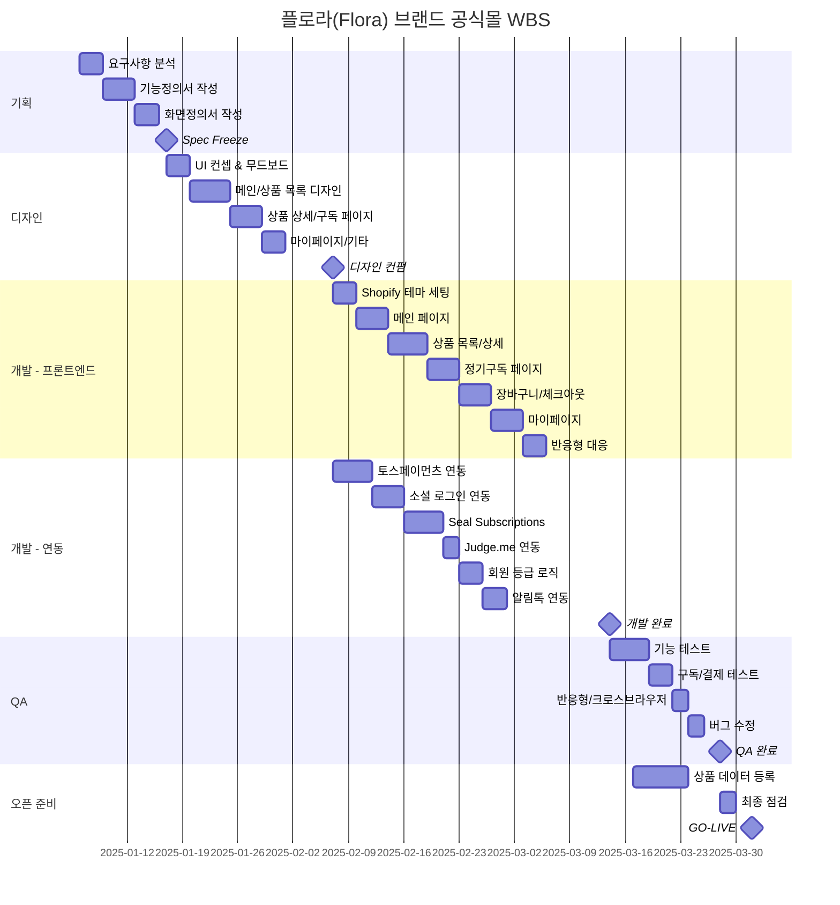

# 플로라(Flora) 브랜드 공식몰 WBS

## 문서 정보

| 항목 | 내용 |
|------|------|
| 프로젝트 | 플로라(Flora) 브랜드 공식몰 구축 |
| 기간 | 2025-01-06 ~ 2025-03-31 (12주) |
| 작성일 | 2025-12-29 |
| 작성자 | LUKUKU (이은재 PM) |

---

## 1. 마일스톤

| No | 마일스톤 | 목표일 | 상태 |
|----|----------|--------|------|
| M1 | Spec Freeze | 2025-01-17 | ⬜ |
| M2 | 디자인 컨펌 | 2025-02-07 | ⬜ |
| M3 | 개발 완료 | 2025-03-14 | ⬜ |
| M4 | QA 완료 | 2025-03-28 | ⬜ |
| M5 | GO-LIVE | 2025-04-01 | ⬜ |

**상태**: ⬜ 대기 / 🔄 진행중 / ✅ 완료 / ⚠️ 지연

---

## 2. 간트 차트

---

## 3. 태스크 목록

### Phase 1: 기획 (1/6 ~ 1/17, 2주)

| ID | 태스크 | 담당 | 일수 | 선행 | 상태 |
|----|--------|------|------|------|------|
| P1-01 | 킥오프 미팅 | PM | 1d | - | ✅ |
| P1-02 | 요구사항 분석 | Spec Owner | 2d | P1-01 | ⬜ |
| P1-03 | 기능정의서 작성 | Spec Owner | 4d | P1-02 | ⬜ |
| P1-04 | 화면정의서 작성 | Spec Owner | 3d | P1-03 | ⬜ |
| P1-05 | 고객 리뷰 & 수정 | PM | 2d | P1-04 | ⬜ |
| **M1** | **Spec Freeze** | - | - | P1-05 | ⬜ |

### Phase 2: 디자인 (1/20 ~ 2/7, 3주)

| ID | 태스크 | 담당 | 일수 | 선행 | 상태 |
|----|--------|------|------|------|------|
| P2-01 | UI 컨셉 & 무드보드 | UI Composer | 3d | M1 | ⬜ |
| P2-02 | 메인 페이지 디자인 | UI Composer | 3d | P2-01 | ⬜ |
| P2-03 | 상품 목록 디자인 | UI Composer | 2d | P2-01 | ⬜ |
| P2-04 | 상품 상세 디자인 | UI Composer | 3d | P2-03 | ⬜ |
| P2-05 | 정기구독 페이지 | UI Composer | 3d | P2-04 | ⬜ |
| P2-06 | 장바구니/체크아웃 | UI Composer | 2d | P2-05 | ⬜ |
| P2-07 | 마이페이지/구독관리 | UI Composer | 2d | P2-06 | ⬜ |
| P2-08 | 팝업/공통 컴포넌트 | UI Composer | 2d | P2-07 | ⬜ |
| P2-09 | 고객 리뷰 & 수정 | PM | 2d | P2-08 | ⬜ |
| **M2** | **디자인 컨펌** | - | - | P2-09 | ⬜ |

### Phase 3: 개발 (2/10 ~ 3/14, 5주)

#### 3.1 프론트엔드 (UI Integrator)

| ID | 태스크 | 담당 | 일수 | 선행 | 상태 |
|----|--------|------|------|------|------|
| P3-01 | Shopify 테마 초기 세팅 | UI Integrator | 2d | M2 | ⬜ |
| P3-02 | 공통 컴포넌트 개발 | UI Integrator | 3d | P3-01 | ⬜ |
| P3-03 | 헤더/푸터 개발 | UI Integrator | 2d | P3-02 | ⬜ |
| P3-04 | 메인 페이지 개발 | UI Integrator | 3d | P3-03 | ⬜ |
| P3-05 | 상품 목록 개발 | UI Integrator | 3d | P3-04 | ⬜ |
| P3-06 | 상품 상세 개발 | UI Integrator | 4d | P3-05 | ⬜ |
| P3-07 | 정기구독 페이지 개발 | UI Integrator | 3d | P3-06 | ⬜ |
| P3-08 | 장바구니 개발 | UI Integrator | 2d | P3-07 | ⬜ |
| P3-09 | 마이페이지 개발 | UI Integrator | 4d | P3-08 | ⬜ |
| P3-10 | 반응형 대응 | UI Integrator | 3d | P3-09 | ⬜ |

#### 3.2 백엔드/연동 (Integrator)

| ID | 태스크 | 담당 | 일수 | 선행 | 상태 |
|----|--------|------|------|------|------|
| P3-11 | 토스페이먼츠 앱 설치 & 설정 | Integrator | 2d | M2 | ⬜ |
| P3-12 | 결제 테스트 환경 구성 | Integrator | 2d | P3-11 | ⬜ |
| P3-13 | 카카오 로그인 연동 | Integrator | 2d | P3-12 | ⬜ |
| P3-14 | 네이버 로그인 연동 | Integrator | 2d | P3-13 | ⬜ |
| P3-15 | Seal Subscriptions 설치 | Integrator | 2d | P3-14 | ⬜ |
| P3-16 | 구독 상품 설정 | Integrator | 3d | P3-15 | ⬜ |
| P3-17 | Judge.me 앱 설치 & 커스텀 | Integrator | 2d | P3-16 | ⬜ |
| P3-18 | 회원 등급 자동화 (Flow) | Integrator | 3d | P3-17 | ⬜ |
| P3-19 | 적립금 시스템 구현 | Integrator | 3d | P3-18 | ⬜ |
| P3-20 | NHN 알림톡 연동 | Integrator | 3d | P3-19 | ⬜ |
| **M3** | **개발 완료** | - | - | P3-10, P3-20 | ⬜ |

### Phase 4: QA (3/17 ~ 3/28, 2주)

| ID | 태스크 | 담당 | 일수 | 선행 | 상태 |
|----|--------|------|------|------|------|
| P4-01 | 테스트 케이스 작성 | Verifier | 2d | M3 | ⬜ |
| P4-02 | 기능 테스트 | Verifier | 3d | P4-01 | ⬜ |
| P4-03 | 구독/결제 시나리오 테스트 | Verifier | 2d | P4-02 | ⬜ |
| P4-04 | 반응형 테스트 | Verifier | 1d | P4-03 | ⬜ |
| P4-05 | 크로스 브라우저 테스트 | Verifier | 1d | P4-04 | ⬜ |
| P4-06 | 버그 리포트 & 수정 | Dev Team | 3d | P4-05 | ⬜ |
| P4-07 | 재테스트 | Verifier | 1d | P4-06 | ⬜ |
| **M4** | **QA 완료** | - | - | P4-07 | ⬜ |

### Phase 5: 오픈 준비 (3/17 ~ 4/1)

| ID | 태스크 | 담당 | 일수 | 선행 | 상태 |
|----|--------|------|------|------|------|
| P5-01 | 상품 데이터 일괄 등록 | 고객사 | 5d | M3 | ⬜ |
| P5-02 | 상품 이미지 업로드 | 고객사 | 3d | P5-01 | ⬜ |
| P5-03 | 프로모션 설정 | 고객사/PM | 2d | P5-02 | ⬜ |
| P5-04 | 최종 점검 | PM | 2d | M4 | ⬜ |
| P5-05 | 도메인 연결 | Integrator | 1d | P5-04 | ⬜ |
| **M5** | **GO-LIVE** | - | - | P5-05 | ⬜ |

---

## 4. 역할별 공수 요약

| 역할 | 총 공수 | 주요 업무 |
|------|---------|----------|
| Spec Owner | 10d | 기능정의서, 화면정의서, WBS |
| UI Composer | 18d | UI/UX 디자인, 컴포넌트 |
| UI Integrator | 29d | Shopify 테마 개발, 프론트엔드 |
| Integrator | 24d | 결제, 구독, 소셜 로그인, Flow |
| Verifier | 10d | QA, 테스트 |
| PM | 8d | 프로젝트 관리, 고객 커뮤니케이션 |

**총 예상 공수**: 99 M/D

---

## 5. 리스크 관리

| 리스크 | 영향도 | 확률 | 대응 방안 |
|--------|--------|------|----------|
| 요구사항 변경 | 높음 | 중간 | Spec Freeze 후 변경 통제, 추가 비용 협의 |
| 토스페이먼츠 연동 이슈 | 높음 | 낮음 | 테스트 환경 조기 구성, 기술지원 문의 |
| Seal Subscriptions 기능 제한 | 중간 | 중간 | 사전 PoC, 대안 앱 검토 |
| 디자인 컨펌 지연 | 중간 | 중간 | 박팀장 대리 컨펌 활용 (김대표 해외 출장) |
| 상품 데이터 준비 지연 | 높음 | 높음 | 템플릿 조기 제공, 샘플 데이터 우선 등록 |
| 생화 배송 로직 복잡도 | 중간 | 낮음 | 배송일 선택 UI 단순화 |

---

## 6. 주간 체크포인트

| 주차 | 날짜 | 예상 진행률 | 체크 항목 |
|------|------|------------|----------|
| W1 | 1/10 | 10% | 요구사항 분석 완료 |
| W2 | 1/17 | 20% | Spec Freeze (M1) |
| W3 | 1/24 | 30% | UI 컨셉 확정 |
| W4 | 1/31 | 40% | 주요 화면 디자인 완료 |
| W5 | 2/7 | 50% | 디자인 컨펌 (M2) |
| W6 | 2/14 | 55% | 테마 세팅 & 공통 컴포넌트 |
| W7 | 2/21 | 65% | 메인/목록/상세 개발 |
| W8 | 2/28 | 75% | 결제/로그인/구독 연동 |
| W9 | 3/7 | 85% | 마이페이지/적립금 개발 |
| W10 | 3/14 | 90% | 개발 완료 (M3) |
| W11 | 3/21 | 95% | QA 진행 |
| W12 | 3/28 | 98% | QA 완료 (M4) |
| **W13** | **4/1** | **100%** | **GO-LIVE (M5)** |

---

**END OF DOCUMENT**
