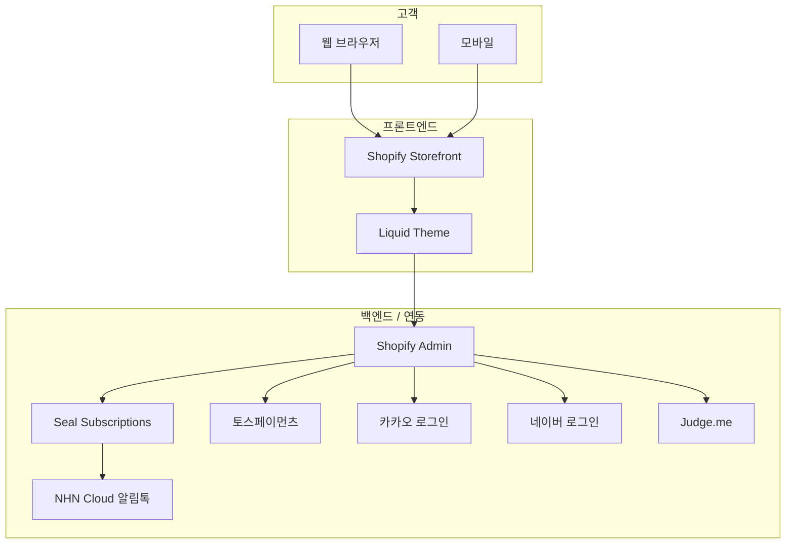

# 플로라(Flora) 브랜드 공식몰 기능정의서

## 문서 정보

| 항목 | 내용 |
|------|------|
| 프로젝트 | 플로라(Flora) 브랜드 공식몰 구축 |
| 버전 | 1.0 |
| 작성일 | 2025-12-29 |
| 작성자 | LUKUKU (이은재 PM) |
| 상태 | Draft |

---

## 1. 프로젝트 개요

### 1.1 목적
플로라(Flora) 브랜드의 Shopify 기반 자사몰 구축. 플라워 & 홈가드닝 전문 쇼핑몰로, **정기구독 서비스**를 핵심 차별점으로 운영.

### 1.2 범위

#### In Scope (포함)
- Shopify 기반 이커머스 플랫폼 구축
- 정기구독 시스템 (월간 플라워 박스)
- 회원 등급제 (일반 / 그린멤버 / VIP)
- 소셜 로그인 (카카오, 네이버)
- 토스페이먼츠 결제 연동
- 희망 배송일 선택 기능
- Judge.me 리뷰 연동
- 카카오 알림톡 연동

#### Out of Scope (제외)
- 선물하기 기능 (Phase 2)
- 꽃말 검색 기능 (Phase 2)
- AI 기반 오늘의 추천 (Phase 2)
- 인스타그램 피드 연동 (Phase 2)
- ERP/POS 연동

### 1.3 시스템 아키텍처

---

## 2. 사용자 역할

| 역할 | 설명 | 주요 기능 |
|------|------|----------|
| 비회원 | 로그인하지 않은 방문자 | 상품 조회, 비회원 구매 |
| 일반 회원 | 가입 직후 ~ 누적 10만원 미만 | 적립금 1%, 기본 쿠폰 |
| 그린멤버 | 누적 10만원 ~ 30만원 미만 | 적립금 2%, 그린멤버 쿠폰 |
| VIP | 누적 30만원 이상 | 적립금 3%, 무료배송, VIP 쿠폰 |
| 관리자 | 스토어 운영자 | 상품/주문/구독 관리 |

---

## 3. 기능 목록

### 3.1 기능 요약

| ID | 기능명 | 우선순위 | 담당 |
|----|--------|----------|------|
| F-001 | 메인 페이지 | P0 | UI Integrator |
| F-002 | 상품 목록/상세 | P0 | UI Integrator |
| F-003 | 소셜 로그인 | P0 | Integrator |
| F-004 | 회원 등급제 | P1 | Integrator |
| F-005 | 적립금 시스템 | P1 | Integrator |
| F-006 | 장바구니 | P0 | UI Integrator |
| F-007 | 주문/결제 | P0 | Integrator |
| F-008 | 정기구독 | P0 | Integrator |
| F-009 | 희망 배송일 선택 | P1 | UI Integrator |
| F-010 | 마이페이지 | P1 | UI Integrator |
| F-011 | 리뷰 시스템 | P1 | Integrator |
| F-012 | 쿠폰 시스템 | P1 | Integrator |
| F-013 | 알림톡 | P2 | Integrator |

---

### 3.2 기능 상세

#### F-001: 메인 페이지
| 항목 | 내용 |
|------|------|
| 설명 | 브랜드 아이덴티티와 주요 상품을 노출하는 랜딩 페이지 |
| 구성요소 | 히어로 배너, 구독 서비스 안내, 베스트 상품, 신상품, 카테고리 |
| 비즈니스 규칙 | 구독 배너는 항상 첫 번째 섹션에 노출 |

#### F-002: 상품 목록/상세
| 항목 | 내용 |
|------|------|
| 설명 | 상품 브라우징 및 상세 정보 확인 |
| 상품 유형 | 일반 상품, 정기구독 상품 |
| 옵션 | 사이즈(S/M/L), 포장 옵션(기본/선물) |
| 필터 | 카테고리, 가격대, 정렬 |

#### F-003: 소셜 로그인
| 항목 | 내용 |
|------|------|
| 설명 | 카카오, 네이버 OAuth 로그인 |
| 신규 회원 | 자동 가입, "일반" 등급 부여 |
| 기존 회원 | 기존 정보로 로그인 |
| 필수 정보 | 이메일, 이름 |

#### F-004: 회원 등급제
| 항목 | 내용 |
|------|------|
| 설명 | 누적 구매금액 기반 자동 등급 부여 |
| 등급 기준 | 일반(0~10만), 그린멤버(10~30만), VIP(30만+) |
| 혜택 | 적립률, 쿠폰, 무료배송(VIP) |
| 자동화 | Shopify Flow로 등급 자동 승급 |

#### F-005: 적립금 시스템
| 항목 | 내용 |
|------|------|
| 설명 | 구매 및 활동에 따른 적립금 지급/사용 |
| 적립률 | 일반 1%, 그린멤버 2%, VIP 3% |
| 리뷰 적립 | 텍스트 500원, 포토 1,000원 |
| 사용 제한 | 결제금액의 최대 10% |

#### F-006: 장바구니
| 항목 | 내용 |
|------|------|
| 설명 | 상품 담기 및 수량 조절 |
| 기능 | 추가, 수량 변경, 삭제, 품절 표시 |
| 비회원 | 세션 기반 장바구니 → 로그인 시 병합 |

#### F-007: 주문/결제
| 항목 | 내용 |
|------|------|
| 설명 | 체크아웃 및 결제 처리 |
| 결제 수단 | 신용카드, 계좌이체, 간편결제 (토스페이먼츠) |
| 배송비 | 3만원 이상 무료, 미만 시 3,000원 |
| 추가 배송비 | 제주/도서산간 5,000원 |
| 생화 불가 지역 | 제주/도서산간 (생화 상품) |

#### F-008: 정기구독
| 항목 | 내용 |
|------|------|
| 설명 | 월간 플라워 박스 정기 배송 서비스 |
| 구독 앱 | Seal Subscriptions |
| 주기 | 2주 / 4주 선택 |
| 할인 | 1~2회차 정가, 3회차 이상 10% 할인 |
| 관리 | 일시정지, 해지, 결제수단 변경 |
| 해지 정책 | 최소 기간 없음, 페널티 없음 |

#### F-009: 희망 배송일 선택
| 항목 | 내용 |
|------|------|
| 설명 | 생화 신선도를 위한 배송일 지정 |
| 선택 가능일 | 화요일, 목요일 (주 2회) |
| 최소 리드타임 | 주문일 기준 3일 후부터 선택 가능 |

#### F-010: 마이페이지
| 항목 | 내용 |
|------|------|
| 설명 | 회원 정보 및 활동 내역 관리 |
| 기능 | 주문 내역, 구독 관리, 적립금, 쿠폰, 리뷰, 회원정보 수정 |

#### F-011: 리뷰 시스템
| 항목 | 내용 |
|------|------|
| 설명 | 상품 구매 후 리뷰 작성 |
| 앱 | Judge.me (무료 플랜) |
| 리뷰 유형 | 텍스트, 포토 |
| 적립금 | 텍스트 500원, 포토 1,000원 |

#### F-012: 쿠폰 시스템
| 항목 | 내용 |
|------|------|
| 설명 | 할인 쿠폰 발급 및 사용 |
| 쿠폰 유형 | 신규가입, 등급별, 프로모션 |
| 사용 조건 | 1회 1쿠폰, 적립금과 중복 사용 가능 |

#### F-013: 알림톡
| 항목 | 내용 |
|------|------|
| 설명 | 카카오 알림톡 자동 발송 |
| 발송 시점 | 주문 확인, 배송 시작, 구독 결제 예정 알림 |
| 연동 | NHN Cloud |

---

## 4. 비즈니스 규칙

| ID | 규칙 | 설명 |
|----|------|------|
| BR-001 | 무료배송 기준 | 주문금액 3만원 이상 시 무료배송 |
| BR-002 | VIP 무료배송 | VIP 등급은 금액 무관 무료배송 |
| BR-003 | 생화 배송 제한 | 생화 상품은 제주/도서산간 배송 불가 |
| BR-004 | 배송일 제한 | 생화는 화/목요일만 배송 |
| BR-005 | 구독 할인 | 3회차 이상 구독 시 10% 할인 |
| BR-006 | 적립금 사용 | 결제금액의 최대 10%까지 사용 |
| BR-007 | 구독 품절 대응 | 품절 시 고객 동의 후 대체 상품 발송 |

---

## 5. 데이터 요구사항

### 5.1 상품 Metafield

| 필드명 | 타입 | 용도 |
|--------|------|------|
| is_subscription | boolean | 정기구독 상품 여부 |
| subscription_discount | number | 구독 할인율 |
| flower_type | single_line_text | 꽃 종류 |
| care_instructions | multi_line_text | 관리 방법 |
| is_fresh_flower | boolean | 생화 여부 (배송 제한용) |

### 5.2 고객 Metafield

| 필드명 | 타입 | 용도 |
|--------|------|------|
| member_tier | single_line_text | 회원 등급 |
| total_spent | number | 누적 구매금액 |
| points_balance | number | 적립금 잔액 |

---

## 6. 연동 시스템

| 시스템 | 용도 | 연동 방식 |
|--------|------|----------|
| 토스페이먼츠 | 결제 | Shopify 앱 |
| Seal Subscriptions | 정기구독 | Shopify 앱 |
| 카카오 로그인 | 소셜 로그인 | OAuth |
| 네이버 로그인 | 소셜 로그인 | OAuth |
| Judge.me | 리뷰 | Shopify 앱 |
| NHN Cloud | 알림톡 | API |

---

**END OF DOCUMENT**
