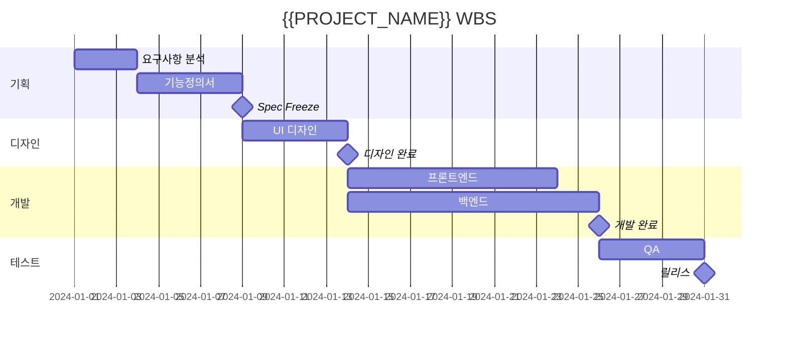

# {{PROJECT_NAME}} WBS

## 문서 정보
- 버전: {{VERSION}}
- 작성일: {{DATE}}
- 기간: {{START_DATE}} ~ {{END_DATE}}

## 1. 마일스톤

| No | 마일스톤 | 목표일 | 상태 |
|----|----------|--------|------|
| M1 | Spec Freeze | MM-DD | ⬜ |
| M2 | 디자인 완료 | MM-DD | ⬜ |
| M3 | 개발 완료 | MM-DD | ⬜ |
| M4 | QA 완료 | MM-DD | ⬜ |
| M5 | 릴리스 | MM-DD | ⬜ |

**상태**: ⬜ 대기 / 🔄 진행중 / ✅ 완료 / ⚠️ 지연

## 2. 간트 차트

## 3. 태스크 목록

### Phase 1: 기획
| ID | 태스크 | 담당 | 일수 | 상태 |
|----|--------|------|------|------|
| P1-01 | 요구사항 수집 | Spec Owner | 2d | ⬜ |
| P1-02 | 기능정의서 작성 | Spec Owner | 3d | ⬜ |

### Phase 2: 개발
| ID | 태스크 | 담당 | 일수 | 상태 |
|----|--------|------|------|------|
| P2-01 | 화면 개발 | UI Integrator | 5d | ⬜ |
| P2-02 | API 개발 | Integrator | 5d | ⬜ |

## 4. 리스크

| 리스크 | 영향도 | 대응 |
|--------|--------|------|
| 요구사항 변경 | 높음 | Spec Freeze 후 변경 통제 |
| 연동 지연 | 중간 | Mock API 준비 |

---
> 상세 내용은 `full/[Template]WBS.md` 참조
