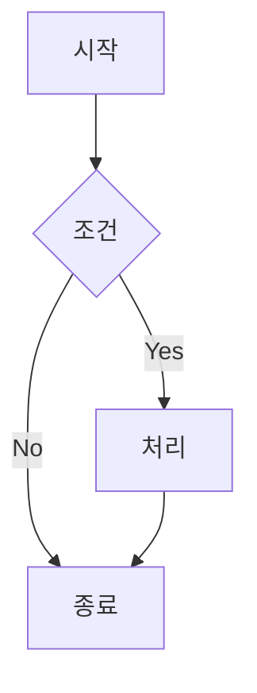

# {{PROJECT_NAME}} 기능정의서

## 문서 정보
- 버전: {{VERSION}}
- 작성일: {{DATE}}
- 작성자: {{AUTHOR}}

## 1. 시스템 개요

**목적**: (1-2문장으로 시스템이 해결하는 문제 기술)

**범위 (In Scope)**:
- 핵심 기능 1
- 핵심 기능 2

**제외 (Out of Scope)**:
- 제외 기능 (사유: )

## 2. 사용자 역할

| 역할 | 주요 권한 |
|------|----------|
| 관리자 | 전체 관리, 설정 |
| 사용자 | 조회, 등록 |

## 3. 핵심 업무 플로우

**비즈니스 규칙**:
- 규칙 1
- 규칙 2

## 4. 주요 기능

| 기능 | 설명 | 우선순위 |
|------|------|----------|
| 기능 1 | 설명 | 높음 |
| 기능 2 | 설명 | 중간 |

## 5. 미확정 사항

- [ ] 미확정 항목 1 - 협의 필요
- [ ] 미확정 항목 2 - 결정 대기

---
> 상세 내용은 `full/[Template]기능정의서.md` 참조
